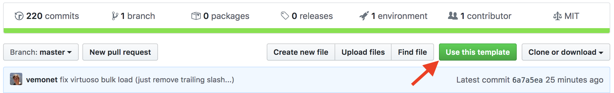

## Define CWL workflows for RDF conversion

Use this template repository to create a new repository used by the [d2s Command Line Interface](https://pypi.org/project/d2s/). 

See **[d2s.semanticscience.org](https://d2s.semanticscience.org/)** for detailed documentation to run CWL workflows to transform structured data to a target RDF knowledge graph and deploy services.



## Requirements

- Install the [d2s client](https://pypi.org/project/d2s/)
- Install [cwlref-runner](https://github.com/common-workflow-language/cwltool#install) to get cwl-runner to run workflows of Docker modules.
- [Docker](https://docs.docker.com/install/) must be installed.

```bash
sudo apt install d2s cwlref-runner
```


Create a project:

```bash
d2s init project-folder-name
```

> Follow the prompt instructions. And see the [d2s.semanticscience.org](https://d2s.semanticscience.org/docs/d2s-services) for the complete documentation.

## Edit this template

You might want to edit or modify this template: 

```bash
git clone --recursive https://github.com/MaastrichtU-IDS/d2s-transform-template.git
```

## Update submodules

You might want to update the `d2s-cwl-workflows` submodule to get the latest updates for the docker deployments definitions:

```shell
./update_submodules.sh
```

## About

We use the [Common Workflow Language](https://www.commonwl.org/) to describe workflows to transform heterogeneous structured data (CSV, TSV, RDB, XML, JSON) to a target RDF data model ([BioLink](https://biolink.github.io/biolink-model/docs/) in those examples). The user defines [SPARQL queries](https://github.com/MaastrichtU-IDS/d2s-transform-template/blob/master/mapping/pharmgkb/insert-pharmgkb.rq) to transform the generic RDF generated depending on the input data structure (AutoR2RML, xml2rdf) to the target model of his choice.

