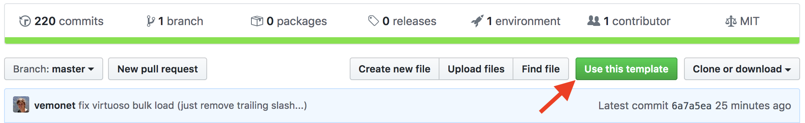

# CWL workflows for RDF conversion

```bash
git clone --recursive https://github.com/MaastrichtU-IDS/d2s-transform-template.git
```

See **[d2s.semanticscience.org](http://d2s.semanticscience.org/)** for detailed documentation on building and running CWL workflows to transform structured data to a target RDF knowledge graph.

Use this template repository to build your transformation workflows:



---

We use the [Common Workflow Language](https://www.commonwl.org/) to describe workflows to transform heterogeneous structured data (CSV, TSV, RDB, XML, JSON) to a target RDF data model ([BioLink](https://biolink.github.io/biolink-model/docs/) in those examples). The user defines [SPARQL queries](https://github.com/MaastrichtU-IDS/d2s-transform-template/blob/master/mapping/pharmgkb/insert-pharmgkb.rq) to transform the generic RDF generated depending on the input data structure (AutoR2RML, xml2rdf) to the target model of his choice.
